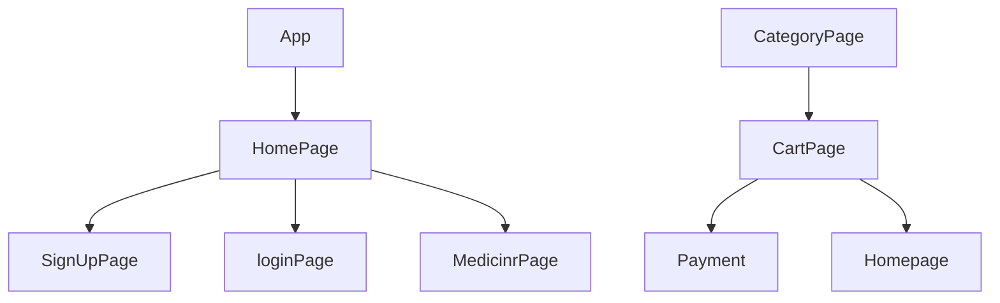

 💻 CLONED PROJECT NAME⭐ ====>>>> ✨Netmeds💫
>  

## 

> A Netmeds website clone is a project to create a platform that provides similar products and services as Netmeds, an Indian online pharmacy. This is an individual project that aims to complete the cloning process within five days. Efficient planning and implementation of technical aspects, such as web development, database management, and payment gateway integration, are essential for success. The website should be user-friendly, responsive, and functional across different devices. Creating a Netmeds website clone within five days requires technical skills, efficient project management, and attention to detail.
---

 

💻Unique Project Name & logo :- Medicine Hub

---

## 💫Tech-Stack->

- #### For Frontend :-

  - `HTML5`
  - `CSS3`
     - `JavaScript `
  - `ReactJS`
     - `ES6 `

- #### For Styling :-

  - `Chakra UI `
  - `React Bootstrap `

- #### For live Project : -
  - `Vercel`

## Features ✨:-

---

| Serial No | Feature                                                                           |
| --------- | --------------------------------------------------------------------------------- |
| 1         | User signup, User Login                                              |
| 2         | Medicine Page with Filter by different Category ,Pagination, Sort Functionalities |
| 3         | payment feature                                              |
| 4         | Dynamic cart page By quentity you can change price                                                    |
| 5         |                                                    |
| 6         | 
---

## Flow

---

## Screenshots 📷

---

# HomePage

# Signup | Login

# Medicine Page

#Cart Page

# Payment Page

---

<h1 align="center">✨Thank You✨</h1>
